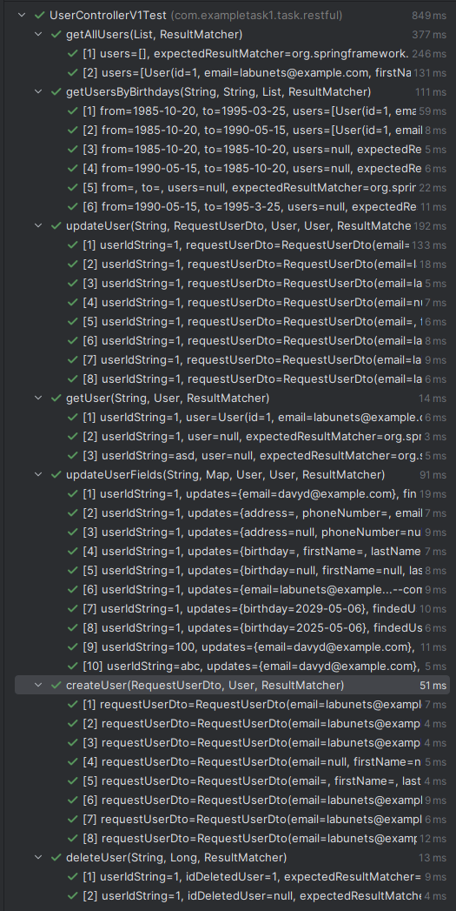

# How to run

1. `git clone`
2. `docker compose up --build`

All requirements have been met

I'm also attaching a collection of postman -> `example.postman_collection.json` in order to easier to test RESTful API

All unit tests using Spring have been passed:

